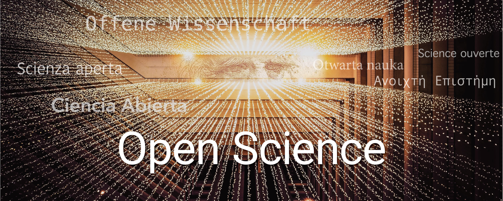

# OASIS

OASIS: Open Access Science for the older adults In Society

## Web service:  

Web service for OASIS is present at: https://plabase.cs.uni-tuebingen.de/oasis/  

## The OASIS Idea:

Open Access Science for the older adults In Society (OASIS) is an inititative that came out during The 3rd Lindau Online #Sciathon . It's a joint work, is mostly promoted by Lindau Alumni. It constitutes an initiative to collect current knowledge about Opening Open Science to Older Adults Worldwide in one comprehensive web platform. We encourage all researchers around the world to contact us and to share there ideas on how to improve or extend our services
  

##  Support for OASIS:

If you have any queries/questions regarding installation, usage, or want us to include new features, etc of  OASIS, please mail us at <a href="mailto:openscience2023@gmail.com" target="_blank" rel="noopener noreferrer">openscience2023@gmail.com</a>.
 

## Publication: 

- Stay tuned.
